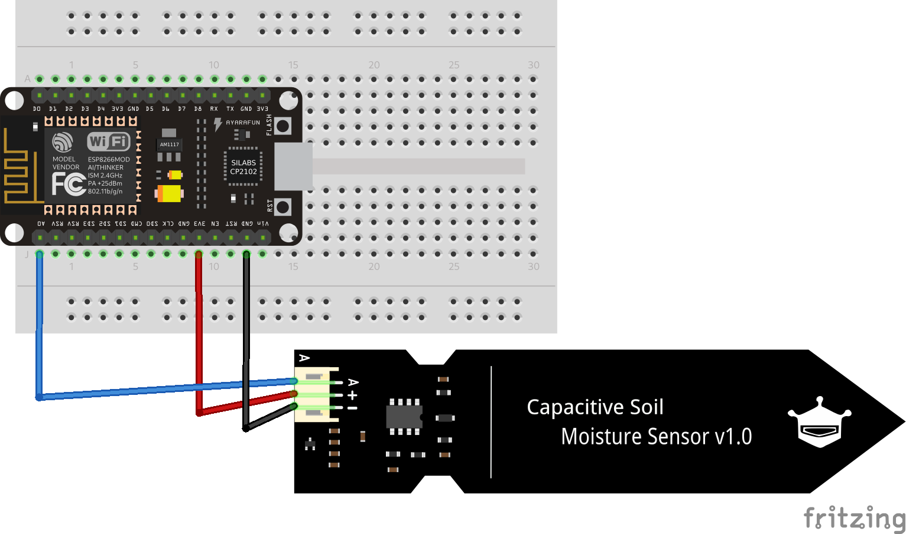
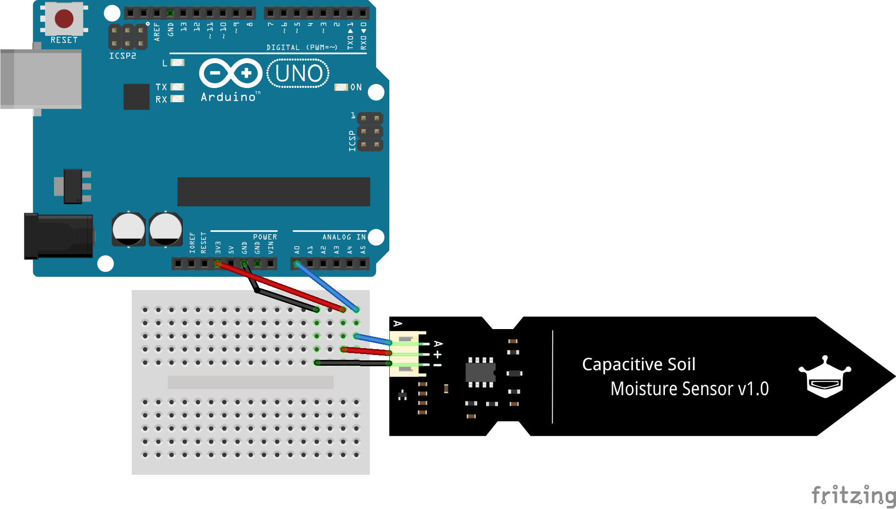

# Capacitive Moisture (Humidity) Sensor Read

Soil humidity sensor read using Arduino Uno or NodeMCU 1.0 (ESP-12E) on Arduino IDE.

 <table >
  <tr>
    <td></td>
    <td></td>
  </tr>
  <tr>
    <td>
Schema for NodeMCU 1.0
</td>
    <td>
Schema for Arduino UNO
</td>
  </tr>
</table>
